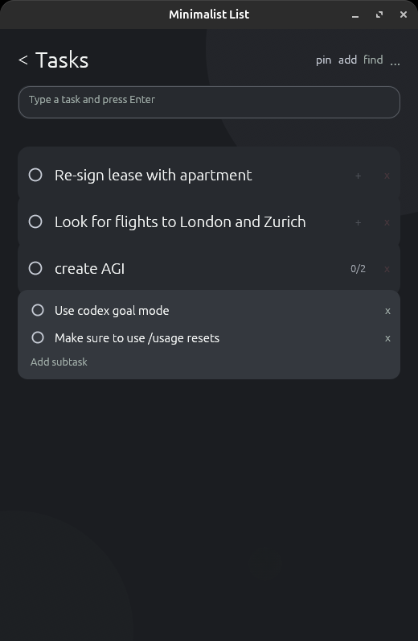

# Minimalist List

Minimalist List is a native desktop task list written in Rust with `egui` and `eframe`. It is built for quick capture, simple checklists, crossing things off, and finding them later.

It runs without an account or hosted service. Folder-backed storage keeps the data under your control and can work with Dropbox or another file-sync service.

The interface takes its low-chrome, typography-led interaction style from MinimaList while adapting it to a native desktop window.

<br>

<br>

## Features

- Fast task entry within a list or through Quick add
- Cross-list task and subtask search
- Multiple lists with subtasks, restorable history, and per-list colors
- Keyboard, pointer, drag-to-reorder, and horizontal swipe interactions
- Native window controls, always-on-top mode, and adjustable typography

## Install and run

Minimalist List requires Rust 1.92 or newer. On Ubuntu, install the native windowing and OpenGL build dependencies:

```bash
sudo apt install \
  build-essential \
  pkg-config \
  libxkbcommon-dev \
  libwayland-dev \
  libx11-dev \
  libgl1-mesa-dev
```

Clone the repository and run the application:

```bash
git clone https://github.com/pszemraj/minimalist-list.git
cd minimalist-list
cargo run
```

Build and run an optimized binary with:

```bash
cargo build --release
./target/release/minimalist-list
```

`Cargo.lock` is committed, so these commands use the dependency versions shipped with the application.

To install the binary and optional Linux desktop entry for the current user:

```bash
cargo install --path .
mkdir -p ~/.local/share/applications
cp minimalist-list.desktop ~/.local/share/applications/
```

The desktop entry expects `minimalist-list` to be available on the desktop session's `PATH`.

## Start using it

Open a list and type into the field at the top. Enter adds the task and returns focus to the field.

Quick add and Find work from any screen while the application is focused. The [usage guide](docs/usage.md) covers shortcuts, gestures, navigation, history, and appearance settings.

## Data and sync

The application uses local JSON files and can place its workspace in Dropbox or a similar service. See [storage and sync](docs/storage.md) for paths, workspace selection, file behavior, and the JSON format.

## Documentation

- [Using Minimalist List](docs/usage.md)
- [Storage and sync](docs/storage.md)
- [Development notes](docs/dev.md)
